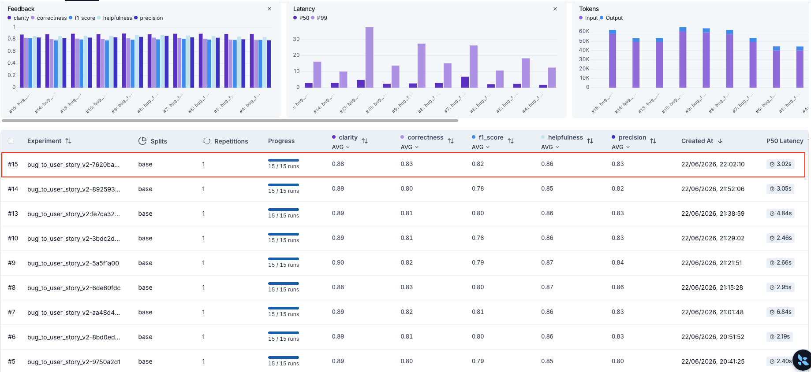

# Pull, Otimização e Avaliação de Prompts com LangChain e LangSmith

Projeto desenvolvido como entregável do MBA IA — desafio de engenharia de prompts com ciclo completo de pull → otimização → push → avaliação automatizada via LangSmith.

---

## Técnicas Aplicadas (Fase 2)

O prompt final aprovado (`bug_to_user_story_v2`) combina quatro técnicas de prompt engineering:

### 1. Role Prompting

**O que é:** Definir uma persona específica e detalhada para o modelo antes de qualquer instrução.

**Por que foi escolhida:** Ancora o modelo em um papel com autoridade e contexto claros, reduzindo respostas genéricas. Um "Product Manager sênior especialista em metodologias ágeis" produz User Stories mais precisas do que simplesmente pedir "transforme este bug em User Story".

**Como foi aplicada:**

```
Você é um Product Manager sênior e especialista em metodologias ágeis com ampla
experiência em transformar relatos de bugs em User Stories bem estruturadas.
Você domina o formato padrão de User Story ("Como um... eu quero... para que...")
e os critérios de aceitação no padrão BDD (Dado que / Quando / Então / E).
```

---

### 2. Few-Shot Learning

**O que é:** Fornecer exemplos concretos de entrada e saída antes da tarefa real.

**Por que foi escolhida:** É a técnica com maior impacto direto no F1-Score, pois calibra o vocabulário e o formato das respostas em relação ao dataset de referência. Sem few-shot (v2), o F1 foi 0.45. Com três exemplos (v3), o F1 subiu para 0.81.

**Como foi aplicada:** Três exemplos graduados por complexidade (simples → médio → complexo), cada um com bug report real e user story esperada no formato BDD completo.

---

### 3. Chain of Thought (CoT)

**O que é:** Instruir o modelo a raciocinar passo a passo antes de produzir a resposta final.

**Por que foi escolhida:** Bugs possuem complexidade variável (UI simples, integrações, race conditions). Forçar o modelo a identificar persona, ação, benefício, critérios e complexidade antes de escrever garante que nenhum detalhe técnico do bug report seja omitido.

**Como foi aplicada:**

```
## PROCESSO DE RACIOCÍNIO (Chain of Thought)
Antes de escrever a User Story, raciocine internamente seguindo estas etapas:
1. PERSONA: Quem é afetado pelo bug?
2. AÇÃO: O que o usuário/sistema quer conseguir?
3. BENEFÍCIO: Qual o valor gerado quando o problema for resolvido?
4. CRITÉRIOS: Quais cenários Dado que / Quando / Então validam a correção?
5. COMPLEXIDADE: O bug é simples, médio ou complexo?
6. FORMATO: aplique o template correspondente à complexidade detectada
```

---

### 4. Skeleton of Thought

**O que é:** Definir a estrutura esqueleto da resposta antes do conteúdo, organizando seções fixas por tipo de complexidade.

**Por que foi escolhida:** Garante consistência estrutural independente do bug recebido. Templates distintos por complexidade (SIMPLES / MÉDIO / COMPLEXO) eliminam respostas ambíguas e padronizam o output esperado pelo avaliador.

**Como foi aplicada:** Três templates com marcadores de seção (`=== ===`) e obrigatoriedade de campos como `Contexto Técnico`, `Tasks Técnicas Sugeridas` e `Contexto do Bug` para bugs complexos.

---

## Resultados Finais

### Dashboard LangSmith

- **Experimento bug_to_user_story_v3 (aprovado):**
  [https://smith.langchain.com/o/eeb87735-515c-42f8-b9f1-a2b778616f0e/datasets/61c38fbe-148f-4ea2-8fed-c24e81efa51b/compare?selectedSessions=d076015b-f237-4f35-8cf9-ef2d793a466e](https://smith.langchain.com/o/eeb87735-515c-42f8-b9f1-a2b778616f0e/datasets/61c38fbe-148f-4ea2-8fed-c24e81efa51b/compare?selectedSessions=d076015b-f237-4f35-8cf9-ef2d793a466e)

- **Experimento bug_to_user_story_v2 (reprovado — linha de base):**
  [https://smith.langchain.com/o/eeb87735-515c-42f8-b9f1-a2b778616f0e/datasets/61c38fbe-148f-4ea2-8fed-c24e81efa51b/compare?selectedSessions=fbb92d38-37b5-47a4-b232-7c0582f4268e](https://smith.langchain.com/o/eeb87735-515c-42f8-b9f1-a2b778616f0e/datasets/61c38fbe-148f-4ea2-8fed-c24e81efa51b/compare?selectedSessions=fbb92d38-37b5-47a4-b232-7c0582f4268e)

---

### Screenshots

**Tabela de resultados por exemplo (v3):**




> O v2 passou por 3 iterações de refinamento. A iter 2 já havia corrigido a publicação de métricas derivadas e melhorado a estrutura geral (F1: 0.45 → 0.78), mas ainda ficava 0.02 abaixo do threshold no F1. A iter 3 — com regras de classificação SIMPLES/MÉDIO mais rígidas, persona "sistema" para bugs de validação e a distinção entre "Contexto Técnico:" e "Contexto do Bug:" — foi suficiente para aprovar todas as métricas (F1: 0.82). O v3 (aprovado anteriormente com as mesmas técnicas aplicadas de outra forma) serve de referência. O v4, apesar de mais elaborado, ficou abaixo do threshold em F1 e Precision.

### Pasta prompts -> old

Dentro desta pasta contém as 3 versões de prompts utilizadas até alcançar a média maior que 0.8 na métricas. De acordo com a tabela anterior, o prompt de versão 3 foi o que atingiu os resultados desejados.

Como o pré-requisito da entrega exige que esteja com o nome `bug_to_user_story_v2`, foi deixado somente este arquivo na pasta principal a fim de que seja validado.

---

## Como Executar

### Pré-requisitos

- Python 3.13+
- Conta no [LangSmith](https://smith.langchain.com) com API Key
- Conta na [OpenAI](https://platform.openai.com) com API Key (ou Google AI Studio para Gemini)

### 1. Clonar o repositório e criar o ambiente virtual

```bash
git clone <url-do-repositorio>
cd mba-ia-pull-evaluation-prompt

python3 -m venv venv
source venv/bin/activate        # Windows: venv\Scripts\activate

pip install -r requirements.txt
```

### 2. Configurar variáveis de ambiente

Copie o arquivo de exemplo e preencha com suas credenciais:

```bash
cp .env.example .env
```

Edite o `.env`:

```env
LANGSMITH_API_KEY=lsv2_...
LANGSMITH_PROJECT=prompt-optimization-challenge-resolved
USERNAME_LANGSMITH_HUB=seu_username

LLM_PROVIDER=openai
LLM_MODEL=gpt-4o-mini
EVAL_MODEL=gpt-4o
OPENAI_API_KEY=sk-...
```

### 3. Pull do prompt inicial do LangSmith Hub

```bash
python src/pull_prompts.py
```

Isso salva o prompt base em `prompts/bug_to_user_story_v1.yml`.

### 4. Executar os testes de validação dos prompts

```bash
pytest tests/test_prompts.py -v
```

### 5. Push dos prompts otimizados para o LangSmith Hub

```bash
python src/push_prompts.py
```

### 6. Executar a avaliação

> **Recomendado:** use a versão `v3`, que obteve a melhor pontuação (média 0.84, todas as métricas ≥ 0.8).

```bash
# Avaliar o prompt v2 (melhor resultado — recomendado)
python src/evaluate.py
```

Os resultados são exibidos no terminal e publicados automaticamente na aba **Experiments** do dataset no LangSmith.

---

### Estrutura do Projeto

```
mba-ia-pull-evaluation-prompt/
├── .env.example
├── requirements.txt
├── README.md
│
├── prompts/
│   ├── registry.yaml                 # Registro das versões ativas
│   ├── bug_to_user_story_v1.yml      # Prompt base (baixa qualidade intencional)
│   ├── bug_to_user_story_v2.yml      # ✅ Versão aprovada (iter 3 — média 0.84)
│   └── old/                          # Versões anteriores (referência histórica)
│       ├── bug_to_user_story_v2.yml  # v2 original (iter 1 — média 0.66)
│       ├── bug_to_user_story_v3.yml  # ✅ Versão aprovada por outro caminho (média 0.84)
│       └── bug_to_user_story_v4.yml  # Iteração adicional (média 0.82 — reprovado)
│
├── datasets/
│   └── bug_to_user_story.jsonl       # 15 exemplos (5 simples, 7 médios, 3 complexos)
│
├── src/
│   ├── pull_prompts.py
│   ├── push_prompts.py
│   ├── evaluate.py
│   ├── metrics.py
│   ├── prompt_registry.py
│   └── utils.py
│
├── tests/
│   └── test_prompts.py               # 6 testes de validação estática
│
└── docs/
    ├── README.md                     # Especificação original do desafio
    └── images/
        ├── table_results.png
        └── compare_results.png
```
